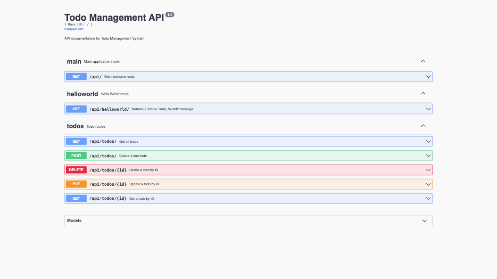

# Flask API Tech Stacks Collection

[](https://github.com/obj809/flask-api-tech-stacks-collection/actions/workflows/tests.yml)

Flask REST API for Todo management with MySQL backend and 96% test coverage.



## Setup

```bash
python3 -m venv venv
source venv/bin/activate
pip install -r requirements.txt
python3 run.py
```

API Documentation: `http://localhost:5001/api/docs`

## Testing

```bash
pytest                           # Run all tests
pytest --cov=app tests/          # With coverage
```

## API Endpoints

- `GET /api/` - Health check
- `GET /api/helloworld/` - Hello world
- `GET /api/todos/` - List todos
- `POST /api/todos/` - Create todo
- `GET /api/todos/<id>` - Get todo
- `PUT /api/todos/<id>` - Update todo
- `DELETE /api/todos/<id>` - Delete todo

See [CLAUDE.md](CLAUDE.md) for detailed documentation.


